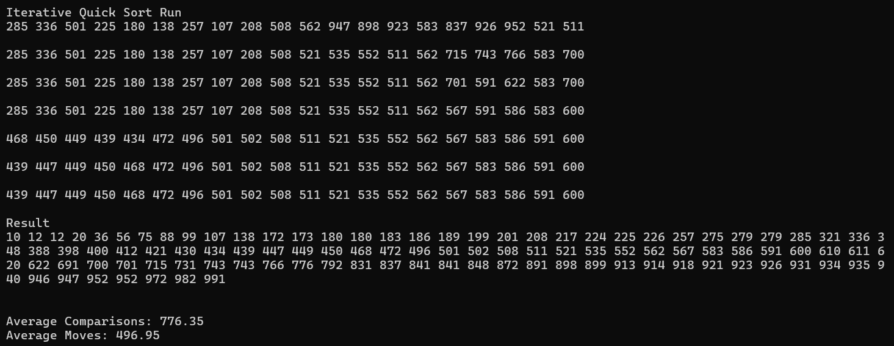

# Quick sort {Result Image}

 *퀵 정렬의 시간 복잡도는 평균은 O(nlogn), 최악은 O(n^2)인데 선택정렬, 삽입정렬, 버블정렬이 O(n^2)인 것에 비하면 평균적으로 퀵 정렬이 좀 더 빠릅니다. 실제로 앞에서 직접 프로그래밍한 결과로도 퀵정렬이 선택정렬, 삽입정렬, 버블정렬보다 평균 비교횟수나 이동횟수가 더 적은 것을 볼 수 있습니다. 그리고 쉘 정렬과 합병 정렬과도 비교하자면 쉘 정렬은 O(n^3/2) ~ O(n^2)의 시간복잡도를 가지고, 합병 정렬은 O(nlogn)의 시간복잡도를 가지는 것을 알고 있습니다. 프로그래밍 결과로는 퀵 정렬이 쉘 정렬보다는 평균 비교 횟수에서 더 나은 결과를 보이지만 합병 정렬보다는 평균 비교 횟수가 더 많았습니다. 허나, 이동 횟수에 초점을 둔다면 퀵 정렬이 가장 적은 평균 이동 횟수를 가진 것을 볼 수 있었습니다. 

**상황에 따라 다를 수 있겠지만, 결과적으로, 퀵 정렬이 대체로 가장 빠릅니다.**
