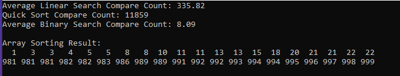
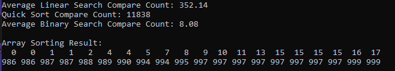

# Compare Searches {Result Image}

이진 탐색이 순차 탐색에 비해 비교 횟수가 적습니다.
순차 탐색은 정렬 여부와 관계없이 데이터를 처음부터 값을 찾을 때까지 순서대로 값을 하나씩 비교하므로 결과에 따르면 300 ~ 400정도로 평균 비교 횟수가 많습니다.
허나, 이진 탐색은 정렬된 데이터에서만 사용할 수 있으며, 정렬된 데이터로 인해 효율적으로 작동하여 결과에 따르면 평균 비교 횟수가 8.xx로 순차탐색에 비해 훨씬 적습니다.
이는 이진 탐색은 탐색 범위를 절반씩 줄여나가는 분할 정복 기법을 사용하기 때문인데 이러한 방식으로 한 번 비교할 때마다 탐색 공간이 절반으로 줄어들기 때문에 비교 횟수가 매우 적어질 수 밖에 없습니다.
