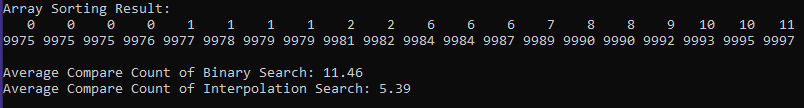
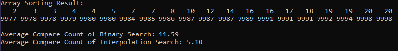
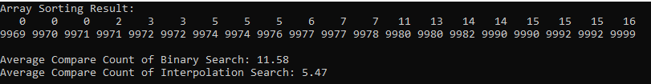

# Interpolation Search {Result Images}

+##Interpolation Search가 Binary Search보다 적게 비교하는 이유
이진 탐색은 탐색 구간을 절반으로 줄여나가는 분할 방식을 사용하는데 이 방식은 탐색 구간의 크기를 고려하지 않고 항상 중앙에서 분할하므로 데이터의 분포와 상관없이 일정한 탐색 경로를 가지게 됩니다.
허나 보간 탐색은 탐색 구간의 크기를 고려한 선형 보간법 계산을 통해서 찾으려는 값의 상대적인 위치를 계산하여 찾고자 하는 값이 존재할 가능성이 높은 위치를 바로 선택합니다.
따라서 보간 탐색은 탐색 구간의 크기를 빠르게 줄이며 키 값을 더 정확히 예측하기 때문에 **균등하게 데이터가 분포되어 있을수록 유리합니다** 이번 과제에서 배열의 모든 인덱스에 데이터가 균등하게 분포가 되어있기 때문에 보간 탐색의 비교횟수가 상대적으로 적습니다.
(반면, 비균등하게 데이터가 분포해있을 때라면, 보간 탐색이 부정확한 위치를 예측하게 되어 이진 탐색보다 성능이 떨어질 수 있습니다.) 
이러한 차이점으로 인해 보간 탐색은 이진 탐색과 달리 더 적은 비교로 원하는 값에 도달할 수 있게 됩니다.
