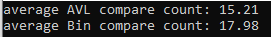
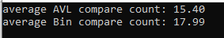
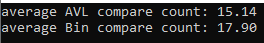

# BST & AVL Tree {Result Image}

AVL 트리가 이진 탐색 트리보다 탐색을 실행했을 때 평균적으로 비교 횟수가 적었습니다.

이는 이진 탐색 트리와 AVL 트리의 높이 차이에서 기인한다고 볼 수 있습니다. 트리의 탐색은 루트 노드에서부터 값을 비교하며 자식 노드로 하나씩 내려가며 실행하기 때문입니다. 이진 탐색트리는 삽입, 삭제 시에 높이를 고려하여 노드의 위치를 변경하지 않으므로, 편향트리가 될 수 있습니다. 허나, AVL 트리는 각 노드에서 좌우 서브트리의 높이 차가 1 이하가 되도록 삽입, 삭제 시마다 좌 또는 우로 회전하며 트리를 재구성합니다. 이로 인해, AVL트리는 항상 균형 잡힌 트리를 유지하여 높이가 이진 탐색 트리의 높이보다 작은 경우가 많습니다.  따라서 트리의 높이가 비교적 더 낮은 AVL 트리가 이진 탐색 트리보다 평균적으로 비교하는 횟수가 적을 수 밖에 없습니다.
